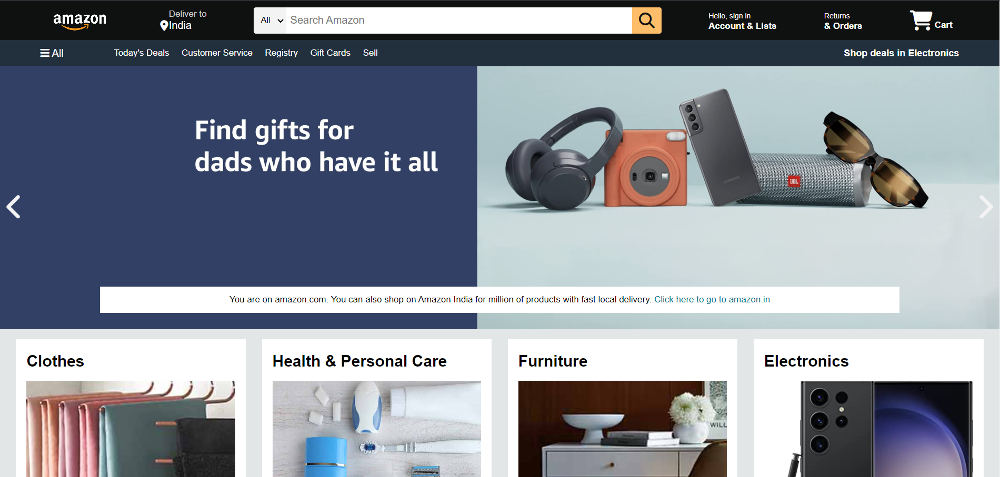
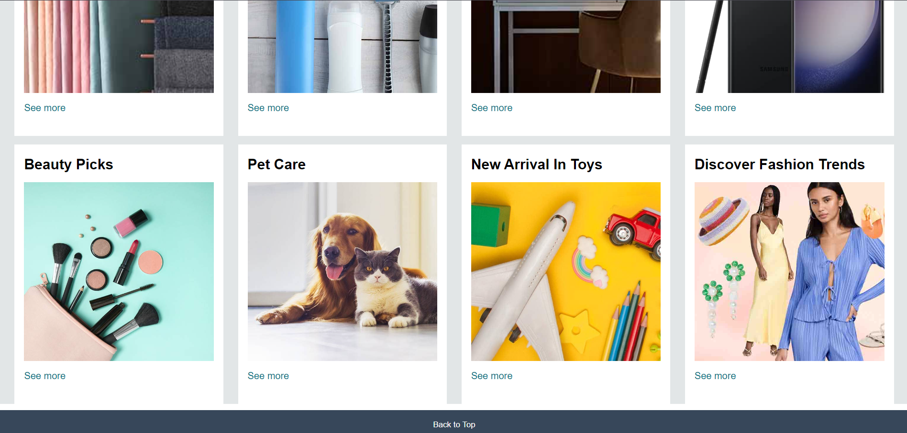

# Amazon Clone

A clone of the Amazon website created to practice and enhance my web development skills using HTML and CSS. The design aims to closely mimic Amazon's layout and styling.

## Features

- **Header Section:** Replicates the Amazon header with navigation links.
- **Product Listings:** Displays various product listings similar to Amazon.
- **Footer Section:** Mimics the footer layout of the Amazon website.

## Screenshots

## Usage

To view the Amazon clone, simply open the `index.html` file in your web browser.

## Credits

- **Developer:** Sukhada ([@sukhada35](https://github.com/sukhada35))
- **Inspiration:** [Amazon](https://www.amazon.com)

